# 百度地图 JavaScript 开源库

一套基于百度地图 JavaScript API 二次开发的开源组件库，提供覆盖物、地图交互、几何运算和时序可视化等常用能力，帮助开发者快速构建地图应用。

所有组件均提供源码、压缩版本和在线示例，既可以直接引用，也可以下载源码后按需修改。

## 功能一览

| 分类 | 组件 |
| --- | --- |
| 可视化 | [热力图](#热力图) · [轨迹动画](#轨迹动画) · [时间轴](#时间轴) · [卷帘对比](#卷帘对比) |
| 覆盖物 | [绘制弧线](#绘制弧线) · [自定义信息窗口](#自定义信息窗口) · [标注管理器](#标注管理器) · [富标注](#富标注) · [聚合 Marker](#聚合-marker) · [自定义覆盖物](#自定义覆盖物) |
| 地图工具 | [路书](#路书) · [测距工具](#测距工具) · [添加标注](#添加标注工具) · [拉框放大](#拉框放大工具) · [区域限制](#区域限制) · [几何运算](#几何运算) · [鼠标绘制](#鼠标绘制工具条) |

## 组件

### 热力图

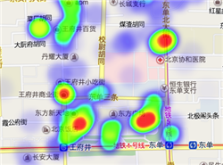

提供热力图可视化展现功能。支持 Chrome、Safari、IE 9 及以上浏览器，核心代码主要来自第三方 [heatmap.js](https://www.patrick-wied.at/static/heatmapjs/)。

[在线示例](https://lbs.baidu.com/jsapi/demo/plugin-old/data-layer/Heatmap.html?version=4.0&type=js) · [源码](src/Heatmap/Heatmap.js) · [压缩源码](src/Heatmap/Heatmap.min.js) · [类参考](http://huiyan-fe.github.io/BMap-JavaScript-library/)

### 绘制弧线

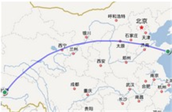

提供弧线绘制能力，并支持拖拽起终点、调整线宽和颜色等编辑操作。

[在线示例](https://lbs.baidu.com/jsapi/demo/plugin-old/draw-edit/curveLine.html?version=4.0&type=js) · [源码](src/CurveLine/CurveLine.js) · [压缩源码](src/CurveLine/CurveLine.min.js) · [类参考](http://huiyan-fe.github.io/BMap-JavaScript-library/)

### 鼠标绘制工具条

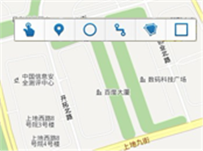

提供点、线、面、多边形、矩形和圆等覆盖物的鼠标绘制与编辑工具。绘制完成后，可以继续使用百度地图 JavaScript API 的覆盖物接口设置样式或开启编辑功能。

[在线示例](https://lbs.baidu.com/jsapi/demo/plugin-old/draw-edit/drawingmanager.html?version=4.0&type=js) · [源码](src/DrawingManager/DrawingManager.js) · [压缩源码](src/DrawingManager/DrawingManager.min.js) · [类参考](http://huiyan-fe.github.io/BMap-JavaScript-library/)

### 自定义信息窗口

类似于 `InfoWindow` 的自定义信息窗口，支持更灵活地定制边框、关闭按钮和窗口位置等样式。

[在线示例](https://lbs.baidu.com/jsapi/demo/plugin-old/overlay-info/infobox.html?version=4.0&type=js) · [源码](src/InfoBox/InfoBox.js) · [压缩源码](src/InfoBox/InfoBox.min.js) · [类参考](http://huiyan-fe.github.io/BMap-JavaScript-library/)

### 标注管理器

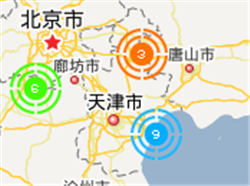

用于管理大量 Marker，提升多标注场景下的加载效率和解析性能。

[在线示例](https://lbs.baidu.com/jsapi/demo/plugin-old/overlay-info/marker-manager.html?version=4.0&type=js) · [源码](src/MarkerManager/MarkerManager.js) · [压缩源码](src/MarkerManager/MarkerManager.min.js) · [类参考](http://huiyan-fe.github.io/BMap-JavaScript-library/)

### 富标注

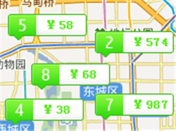

支持自定义 Marker 展现形式，并提供点击、双击、拖拽等事件。

[在线示例](https://lbs.baidu.com/jsapi/demo/plugin-old/overlay-info/richmarker.html?version=4.0&type=js) · [源码](src/RichMarker/RichMarker.js) · [压缩源码](src/RichMarker/RichMarker.min.js) · [类参考](http://huiyan-fe.github.io/BMap-JavaScript-library/)

### 路书

实现 Marker 沿路线运动，并支持暂停等控制能力，也可以使用自定义图标。

[在线示例](https://lbs.baidu.com/jsapi/demo/plugin-old/track-animation/lushu.html?version=4.0&type=js) · [源码](src/LuShu/LuShu.js) · [压缩源码](src/LuShu/LuShu.min.js) · [类参考](http://huiyan-fe.github.io/BMap-JavaScript-library/)

### 测距工具

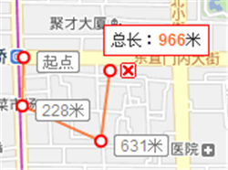

允许用户在地图上点击完成距离测量，并支持自定义测距线样式、线宽、颜色和结果单位。

[在线示例](https://lbs.baidu.com/jsapi/demo/plugin-old/draw-edit/distancetool.html?version=4.0&type=js) · [源码](src/DistanceTool/DistanceTool.js) · [压缩源码](src/DistanceTool/DistanceTool.min.js) · [类参考](http://huiyan-fe.github.io/BMap-JavaScript-library/)

### 聚合 Marker

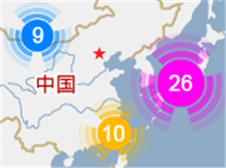

通过聚合大量点要素，减少覆盖现象并提升地图渲染性能。主入口类为 `MarkerClusterer`。

[在线示例](https://lbs.baidu.com/jsapi/demo/plugin-old/data-layer/marker-clusterer.html?version=4.0&type=js) · [源码](src/MarkerClusterer/MarkerClusterer.js) · [压缩源码](src/MarkerClusterer/MarkerClusterer.min.js) · [类参考](http://huiyan-fe.github.io/BMap-JavaScript-library/)

### 添加标注工具

允许用户在地图上点击添加点标注，并支持自定义标注图标和连续添加。

[在线示例](https://lbs.baidu.com/jsapi/demo/plugin-old/draw-edit/markertool.html?version=4.0&type=js) · [源码](src/MarkerTool/MarkerTool.js) · [压缩源码](src/MarkerTool/MarkerTool.min.js) · [类参考](http://huiyan-fe.github.io/BMap-JavaScript-library/)

### 自定义覆盖物

由文字和图标组成的地图覆盖物，继承自 `Overlay`。

[在线示例](https://lbs.baidu.com/jsapi/demo/plugin-old/overlay-info/texticon-overlay.html?version=4.0&type=js) · [源码](src/TextIconOverlay/TextIconOverlay.js) · [压缩源码](src/TextIconOverlay/TextIconOverlay.min.js) · [类参考](http://huiyan-fe.github.io/BMap-JavaScript-library/)

### 拉框放大工具

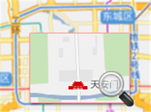

支持在地图上执行拉框放大或缩小操作，并可自定义缩放动画和遮盖层样式。

[在线示例](https://lbs.baidu.com/jsapi/demo/plugin-old/draw-edit/rectangle-zoom.html?version=4.0&type=js) · [源码](src/RectangleZoom/RectangleZoom.js) · [压缩源码](src/RectangleZoom/RectangleZoom.min.js) · [类参考](http://huiyan-fe.github.io/BMap-JavaScript-library/)

### 区域限制

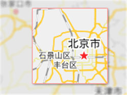

通过设置 `Bounds` 限定地图可浏览区域。

[在线示例](https://lbs.baidu.com/jsapi/demo/plugin-old/search-control/area-restriction.html?version=4.0&type=js) · [源码](src/AreaRestriction/AreaRestriction.js) · [压缩源码](src/AreaRestriction/AreaRestriction.min.js) · [类参考](http://huiyan-fe.github.io/BMap-JavaScript-library/)

### 几何运算

提供点与矩形、圆形、多边形线、多边形面关系判断，以及折线长度和多边形面积计算。

[在线示例](https://lbs.baidu.com/jsapi/demo/plugin-old/draw-edit/geoutils.html?version=4.0&type=js) · [源码](src/GeoUtils/GeoUtils.js) · [压缩源码](src/GeoUtils/GeoUtils.min.js) · [类参考](http://huiyan-fe.github.io/BMap-JavaScript-library/)

### 轨迹动画

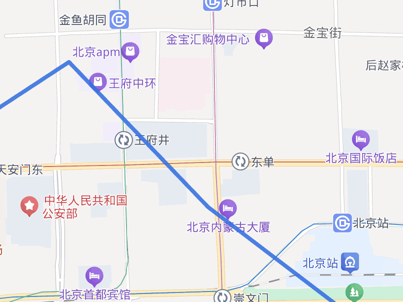

提供地图视角沿轨迹运动的动画展示效果。

[在线示例](https://lbs.baidu.com/jsapi/demo/plugin-old/track-animation/trackanimation.html?version=4.0&type=js) · [源码](src/TrackAnimation/TrackAnimation.js) · [压缩源码](src/TrackAnimation/TrackAnimation.min.js) · [类参考](http://huiyan-fe.github.io/BMap-JavaScript-library/)

### 时间轴

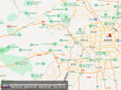

提供时间轴控件，支持播放和暂停，方便结合地图展示时序数据。

[在线示例](https://lbs.baidu.com/jsapi/demo/plugin-old/track-animation/timeline.html?version=4.0&type=js) · [源码](src/Timeline/Timeline.js) · [压缩源码](src/Timeline/Timeline.min.js) · [样式](src/Timeline/Timeline.css) · [类参考](http://huiyan-fe.github.io/BMap-JavaScript-library/)

### 卷帘对比

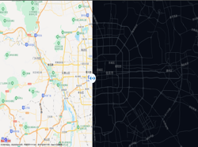

叠加两张地图，通过拖拽中线实现左右卷帘对比。

[在线示例](https://lbs.baidu.com/jsapi/demo/plugin-old/search-control/swipe.html?version=4.0&type=js) · [源码](src/Swipe/Swipe.js) · [压缩源码](src/Swipe/Swipe.min.js) · [样式](src/Swipe/Swipe.css) · [类参考](http://huiyan-fe.github.io/BMap-JavaScript-library/)
